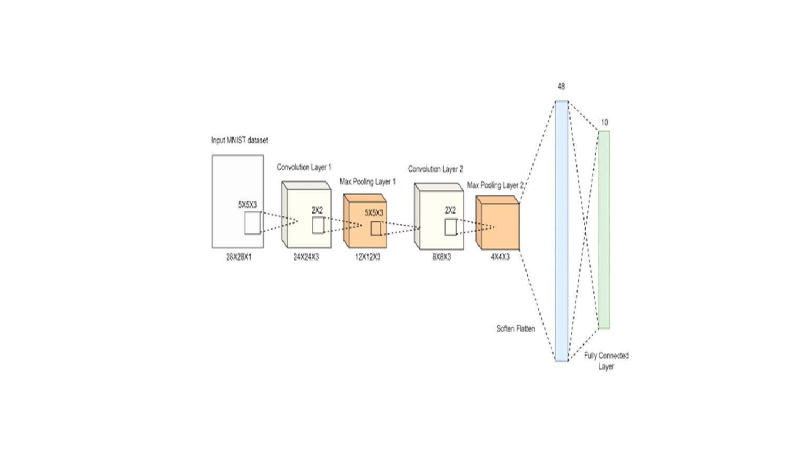

FPGA : PYNQ-Z2 
Frequency = 125Mhz

Tool : PyThorch, Vivado

CNN Structure
The structure of the adopted CNN is 2-layer below, and the parameters are set as follows. 

● Batch Size = 64 
● Training Epoch = 10 
● Learning Rate = 0.01 
● Optimizer = Stochastical Gradient Descent (Momentum = 0.5) 
● Activation Function = ReLU 

Design Goal
1. Weight extraction and quantization using PyTorch 
   1) Leverages CNN models trained with PyTorch 
   2) Weight and bias extraction and purification 
   3) Applying log2-based quantization 
   4) .txt file conversion and save and read 

   

in the bottom, it is our presentation.   
[Uploading 최종ppt_final.pptx…]()
