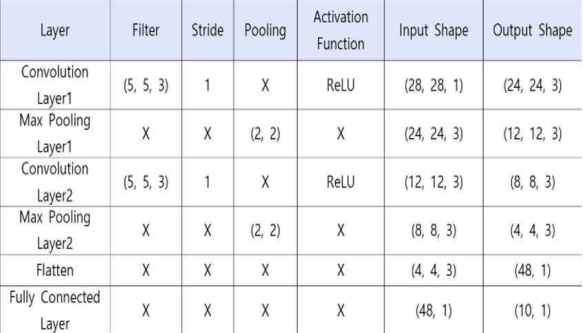
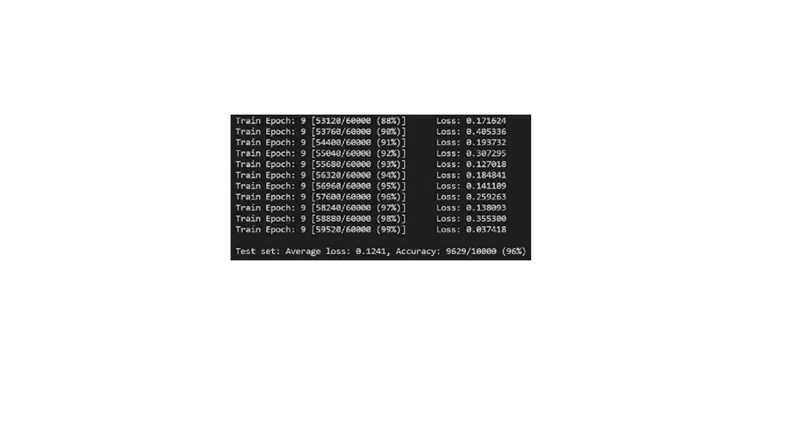
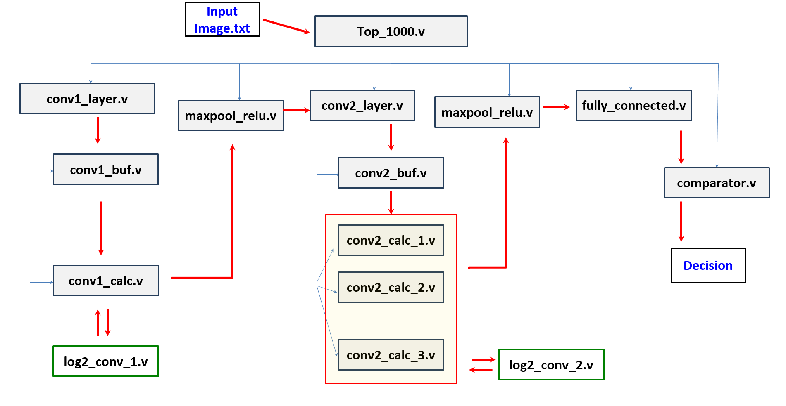
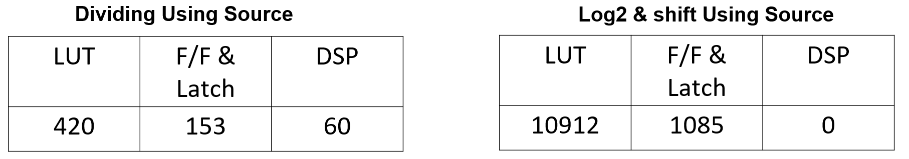

FPGA : PYNQ-Z2 
Frequency = 125Mhz

Tool : PyThorch, Vivado

Design Goal
1. Weight extraction and quantization using PyTorch 
   1) Leverages CNN models trained with PyTorch 
   2) Weight and bias extraction and purification 
   3) Applying log2-based quantization 
   4) .txt file conversion and save and read 
   
2. Using vivado to design RTL code 

   1) Table .v FILE 
     

   
   2) To utilize low power, the Log2 shift method is used instead of dividing. 

CNN Structure 
The structure of the adopted CNN is 2-layer below, and the parameters are set as follows. 
We use MNIST Dataset 

● Batch Size = 64 
● Training Epoch = 10 
● Learning Rate = 0.01 
● Optimizer = Stochastical Gradient Descent (Momentum = 0.5) 
● Activation Function = ReLU 

we could check the accuracy of about 96%. 

RTL Code BlockDiagram 

Compare Resource

in the bottom, it is our presentation.   
[Uploading 최종ppt_final.pptx…]()
