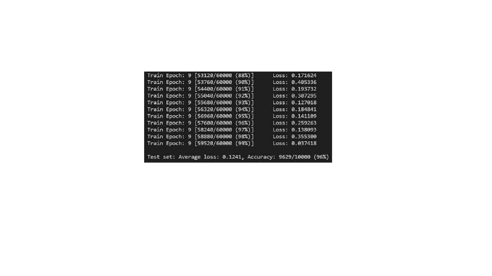

# CNN FPGA Implementation

FPGA : PYNQ-Z2  
Frequency : 125 MHz  

Tool : PyTorch, Vivado  
Baseline : [CNN-Implementation-in-Verilog](https://github.com/boaaaang/CNN-Implementation-in-Verilog)

---

## Design Goal

### 1. Weight Extraction and Quantization Using PyTorch

1. Leverages CNN models trained with PyTorch
2. Weight and bias extraction and purification
3. Applying log2-based quantization
4. `.txt` file conversion, save, and read

### 2. RTL Design Using Vivado

1. Table `.v` file

2. To utilize low power, the Log2 shift method is used instead of dividing.

---

## CNN Structure

The structure of the adopted CNN is 2-layer below, and the parameters are set as follows.

We use MNIST Dataset.

| Parameter | Value |
|---|---|
| Batch Size | 64 |
| Training Epoch | 10 |
| Learning Rate | 0.01 |
| Optimizer | Stochastical Gradient Descent, Momentum = 0.5 |
| Activation Function | ReLU |

We could check the accuracy of about 96%.

---

## RTL Code Block Diagram

---

## Simulation Result

Input : `1000`

---

## Resource Comparison

---

## Presentation

In the bottom, it is our presentation.

- [캡스톤디자인_CNN.pdf](https://github.com/user-attachments/files/28446940/_CNN.pdf)
