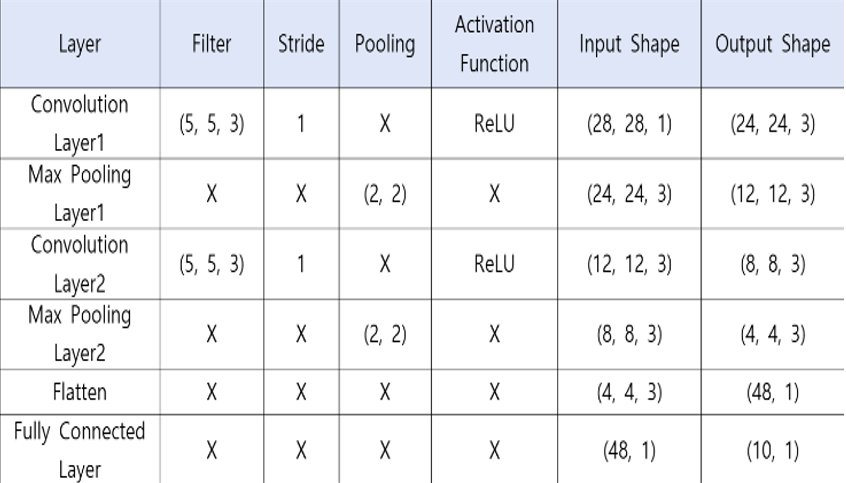
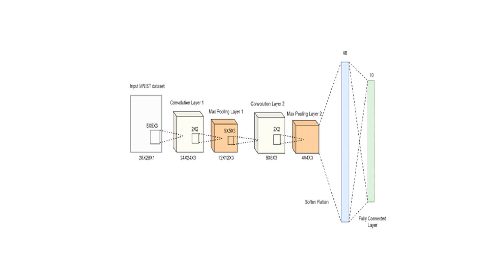
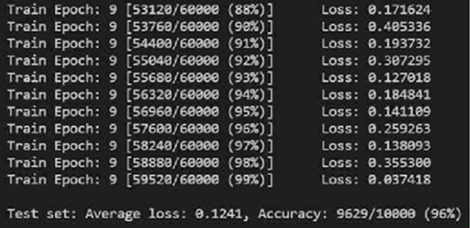
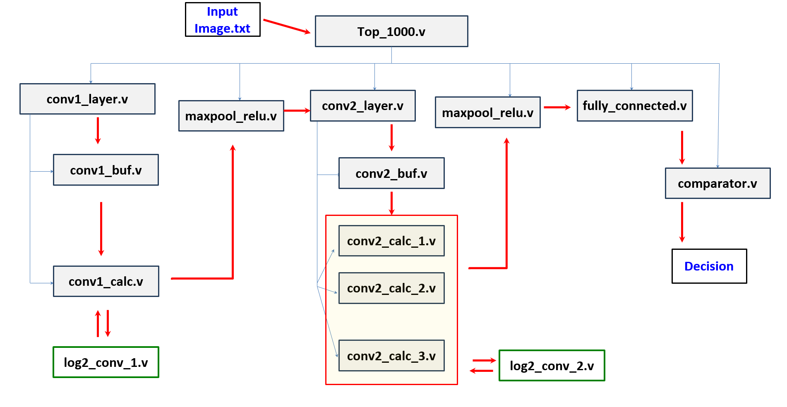
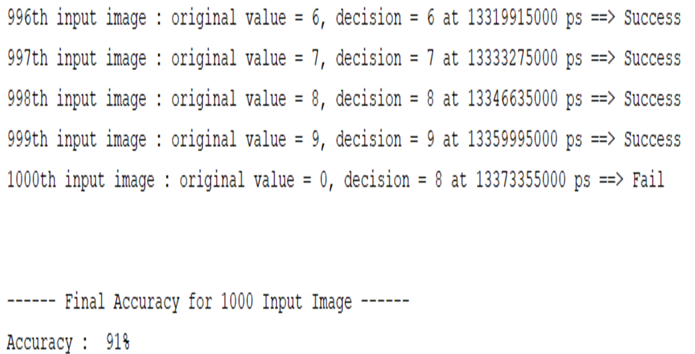
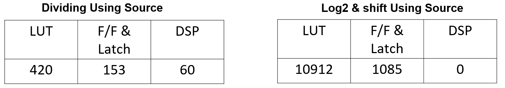

# CNN FPGA Implementation

FPGA : PYNQ-Z2  
Frequency : 125 MHz  

Tool : PyTorch, Vivado  
Baseline : [CNN-Implementation-in-Verilog](https://github.com/boaaaang/CNN-Implementation-in-Verilog)

---

## Design Goal

### 1. Weight Extraction and Quantization Using PyTorch

1. Leverages CNN models trained with PyTorch
2. Weight and bias extraction and processing
3. Applying log2-based quantization
4. `.txt` file conversion, save, and read

### 2. RTL Design Using Vivado

1. Table `.v` file

2. To reduce hardware resource usage and power consumption, the Log2 shift method is used instead of division operation.

The Log2 shift method replaces complex arithmetic operations with shift-based operations.  
By using shift operations instead of division or multiplication, the hardware structure can be simplified and DSP usage can be reduced.

---

## CNN Structure

The adopted CNN has a 2-layer structure, and the parameters are set as follows.

MNIST Dataset is used for training and testing.

| Parameter | Value |
|---|---|
| Batch Size | 64 |
| Training Epoch | 10 |
| Learning Rate | 0.01 |
| Optimizer | Stochastic Gradient Descent, Momentum = 0.5 |
| Activation Function | ReLU |

The trained model achieved about 96% accuracy.

---

## RTL Code Block Diagram

---

## Simulation Result

Input : `1000`

The simulation result was checked to verify that the RTL design produces the expected output value.

---

## Board Verification

The CNN RTL design was implemented on the PYNQ-Z2 board.

After synthesis and implementation in Vivado, the bitstream was generated and uploaded to the board.  
The output value was checked on the board to verify that the CNN operation works correctly in hardware.

---

## Resource Comparison

The resource usage was compared to check the effect of the Log2 shift method.

| Resource | Description |
|---|---|
| LUT | Logic resource used for combinational logic |
| FF | Register resource used for sequential logic |
| DSP | Hardware arithmetic block used for multiplication and complex operations |
| BRAM | Memory block used for storing data or parameters |

By replacing arithmetic operations with shift-based operations, the design reduces the need for DSP blocks.  
As a result, the CNN operation can be implemented with lower hardware resource usage.

---

## Presentation

In the bottom, it is our presentation.

- [캡스톤디자인_CNN.pdf](https://github.com/user-attachments/files/28446940/_CNN.pdf)
